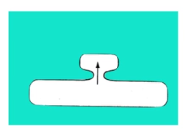
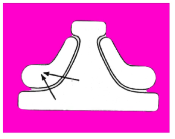
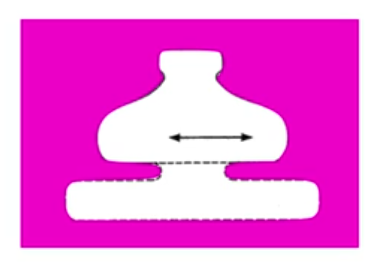
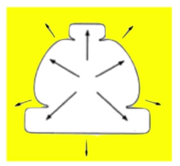
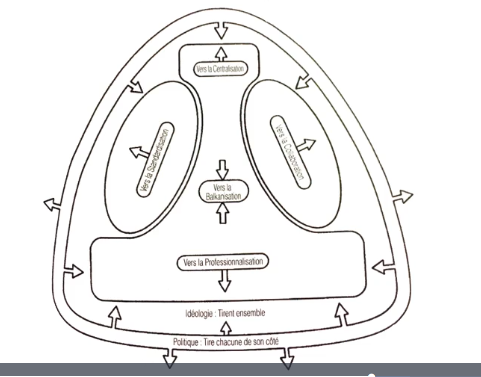

# Analyser les métiers et la culture d'une organisation - la culture

Comment la taille de chaque partie nous renseigne sur la culture
de l'orga.

**7 configurations type**

## Entreprenariale

ex : concession automobile, gov w/ chef autocrate

- une personne dirige l'ensemble de la structure
- décisions très rapides car 1 seule personne les prend toutes
- *m* ne gère pas bien la complexité

## Mécaniste

ex : poste, compagnie aérienne, aciérie

- grosse technostructure, standardisation
- très efficace
- peu de flexibilité
- centre opé peut autonome

## Divisionnalisée

ex : différents ministères, multinationales

- grosse ligne hiérarchique puissante
- chaque division correspond à un marché
- un peu plus de souplesse et de spécialisation
- risque de morcèlement

## Professionnelle

ex : hôpital, université

- CO très autonome => faire face à enviro complexe et cas particuliers
- technostructure réduite
- risque peu de collaboration

## Innovante

ex : startup, agence spatiale

- ni procédure ni hiérarchie
- pas scalable => orga par projet
- orga par projet => compétition

## Missionnaire

ex : parti politique, syndicat, église, ONG, petit projet open-source

- membres rassemblés par une idéologie commune

## Politique

ex : AN, syndicat de copro, conseil de classe, gros projet open-source

- membres rassemblés par leur *désacord*

## Forces fondamentales

