Maxime Huyghe

# TP IF37 Unity - Compte rendu

## Processus

La scène de départ.

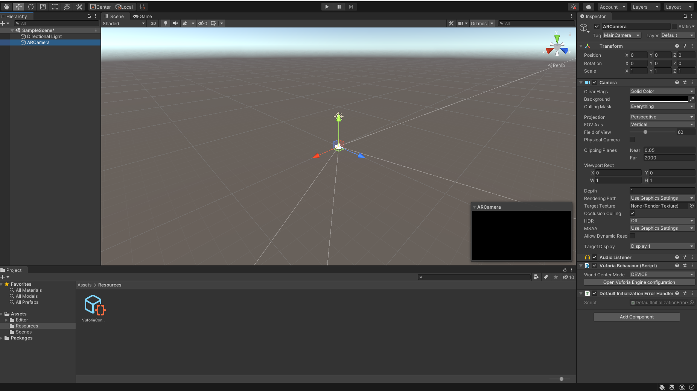

J'ai ajouté la première Image Target (billet). J'ai dû télécharger la database
depuis le site de Vuforia et l'importer manuellement.

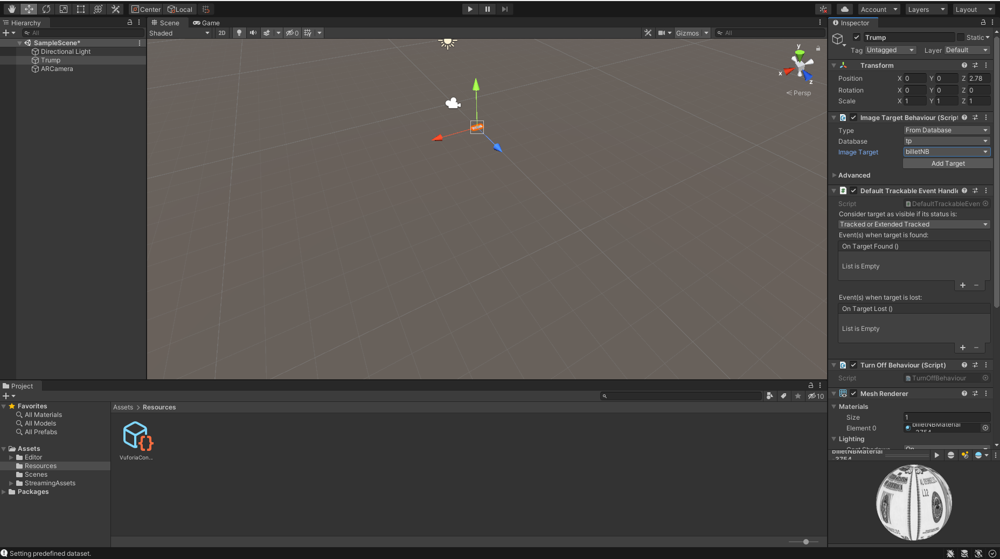

Dans un premier temps, j'ai essayé de faire le TP sous Linux, mais j'avais
des erreurs et des écrans noirs. J'ai donc réessayé sous Windows, et ça
fonctionne. J'ai aussi ajouté la deuxième target.

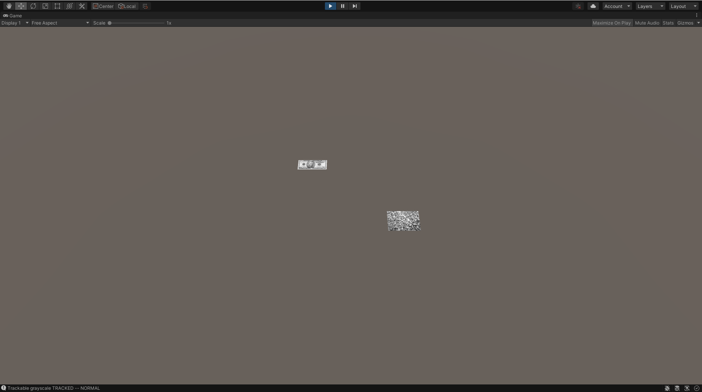

J'ai ajouté le modèle de Trump.

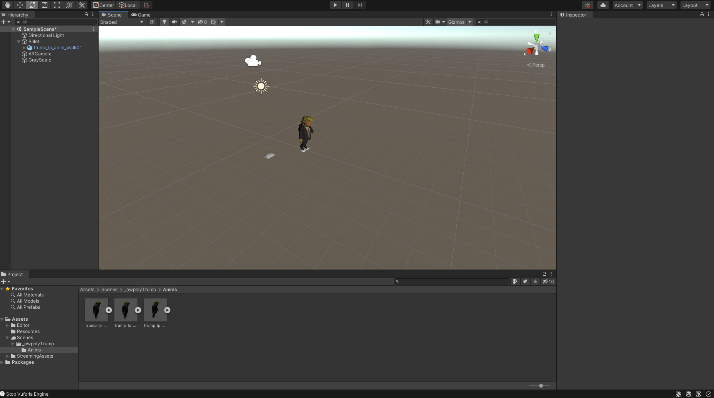

J'ai changé son orientation et mis l'animation en mode loop (la position de
cette option a changé).

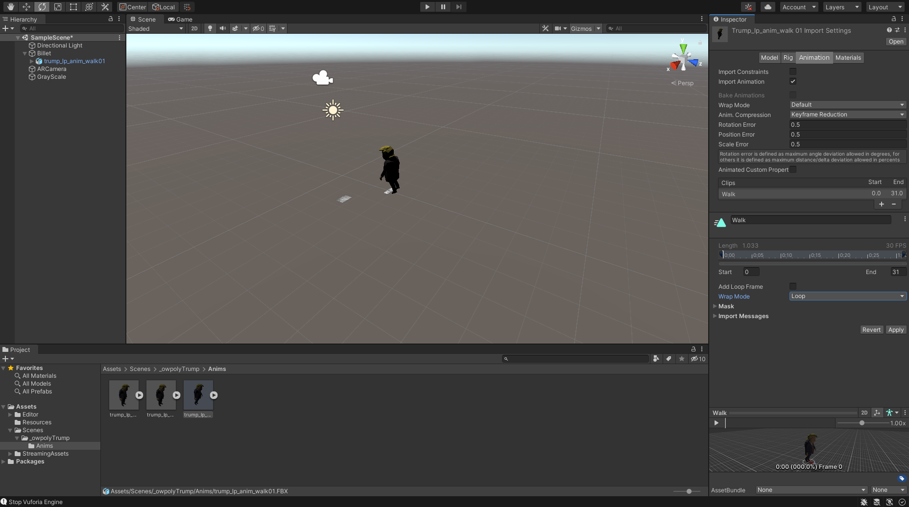

Tout fonctionne dans le mode simulateur.

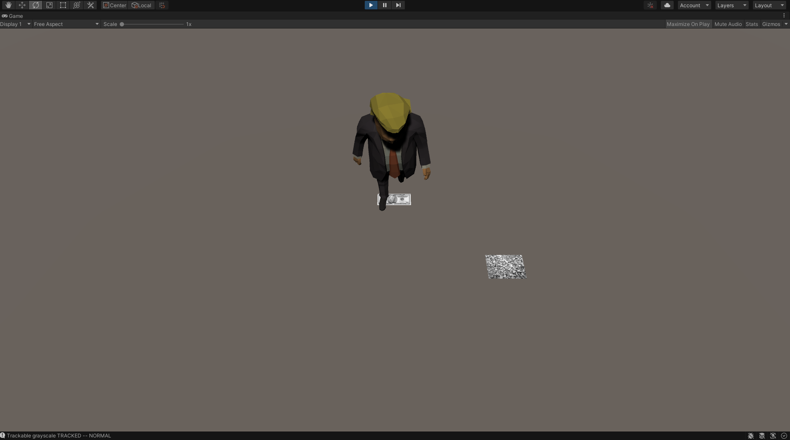

Dans la réalité (augmentée) Trump est un peu trop grand...

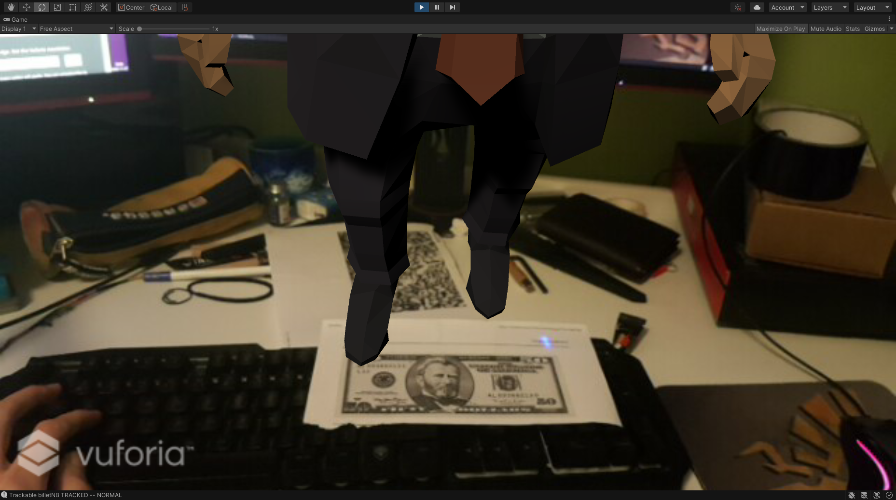

J'ai donc réglé la scale de la target correspondante à 0.1.

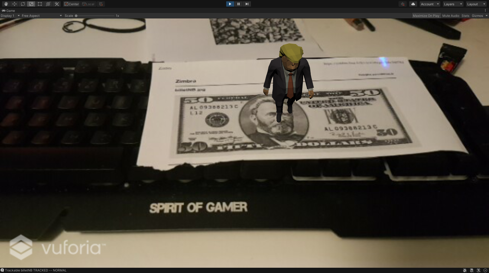

J'ai ensuite désactivé le démarrage automatique de l'animation.

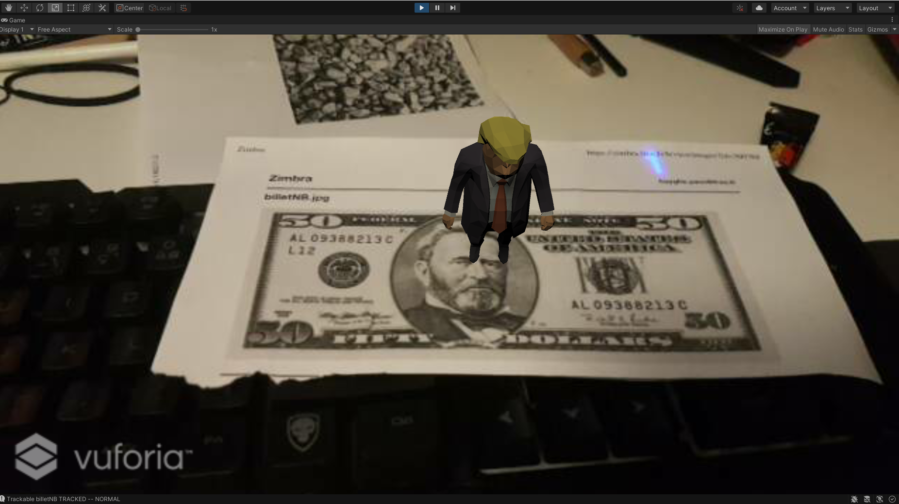

J'ai ensuite ajouté un deuxième personnage (Amane Kisora-chan), qui s'affiche
bien, mais Vuforia ne détecte malheureusement pas les deux targets en même
temps.

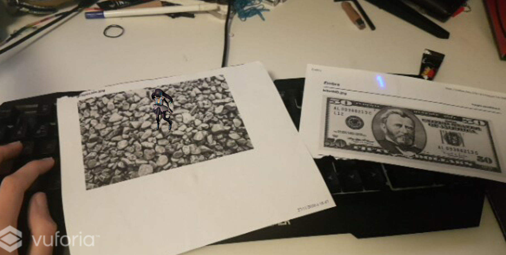

Après ça, j'ai ajouté le script d'animation...

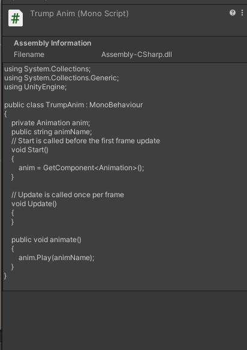

...puis un bouton.

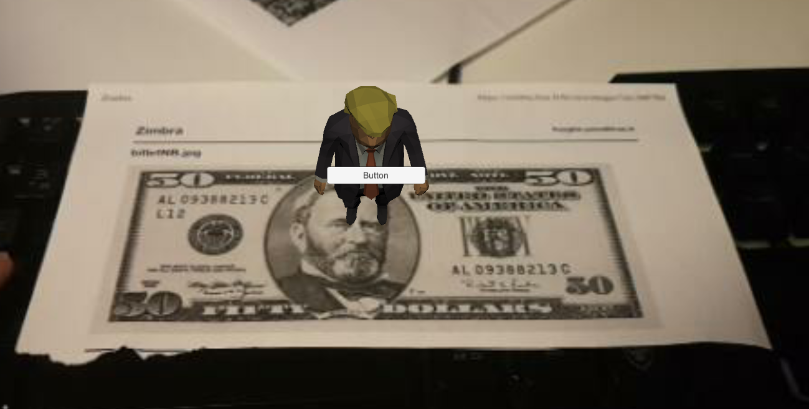

J'ai eu quelques difficultés à ajouter le OnClick au bouton, notamment car le
drag-and-drop ne fonctionnait pas. Il a fallu que je cherche le modèle de Trump
dans la scène depuis le menu d'ajout du OnClick.

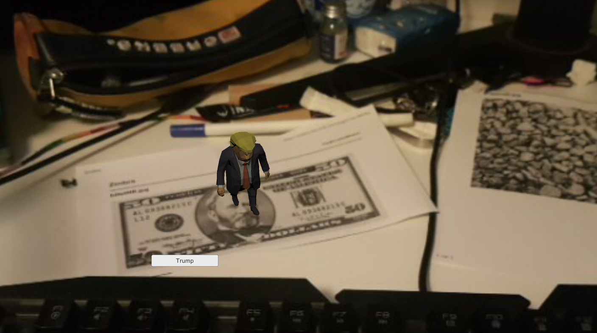

J'ai répété la procédure pour donner une animation "pose de victoire" au
deuxième personnage.

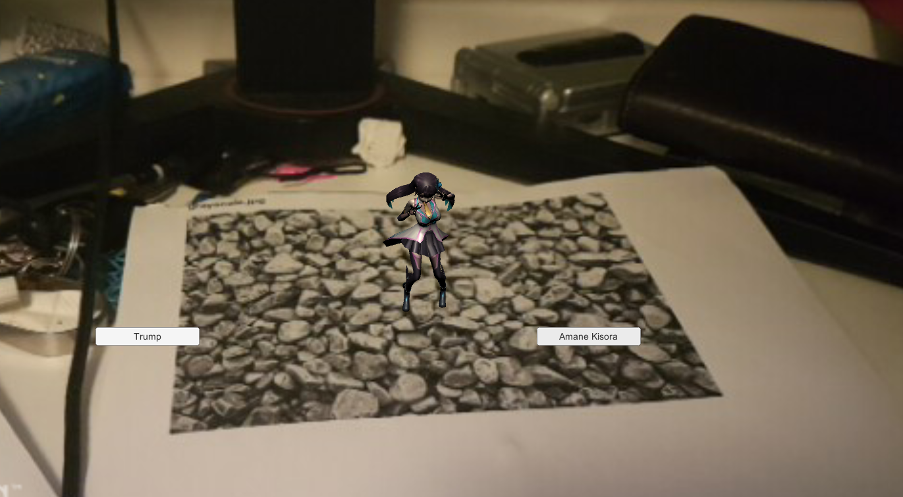

## Conclusion

Je suis toujours aussi impressioné par les possibilités de prototypage offertes
par Unity, mais assez déçu d'avoir passé tout ce temps à essayer de faire
fonctionner Vuforia sous Linux.

