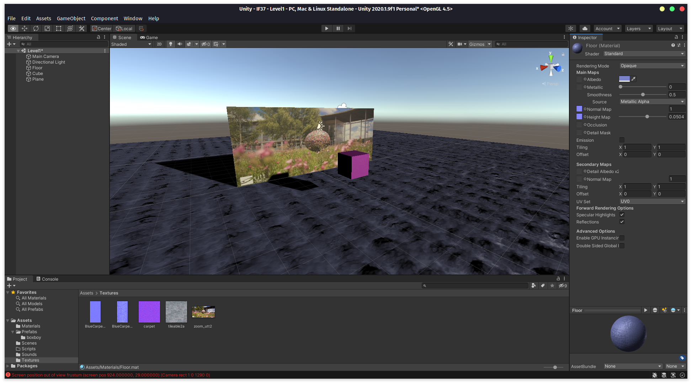
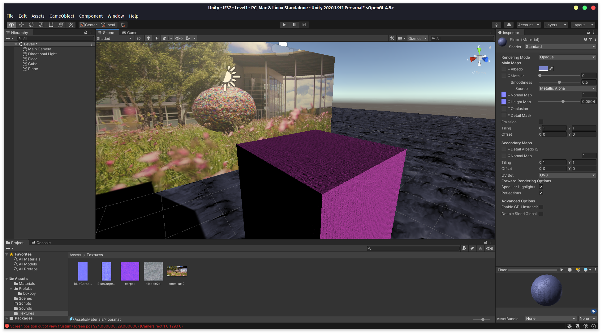
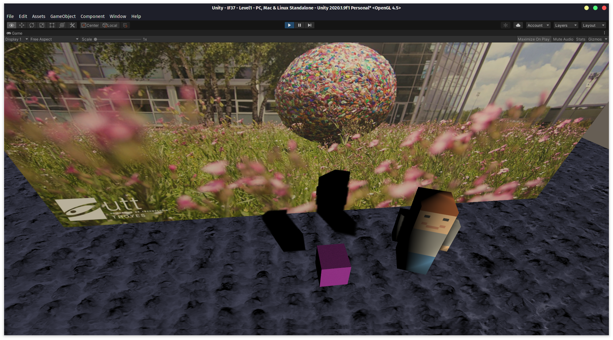
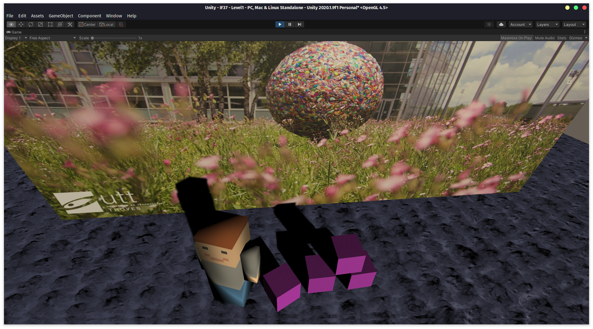
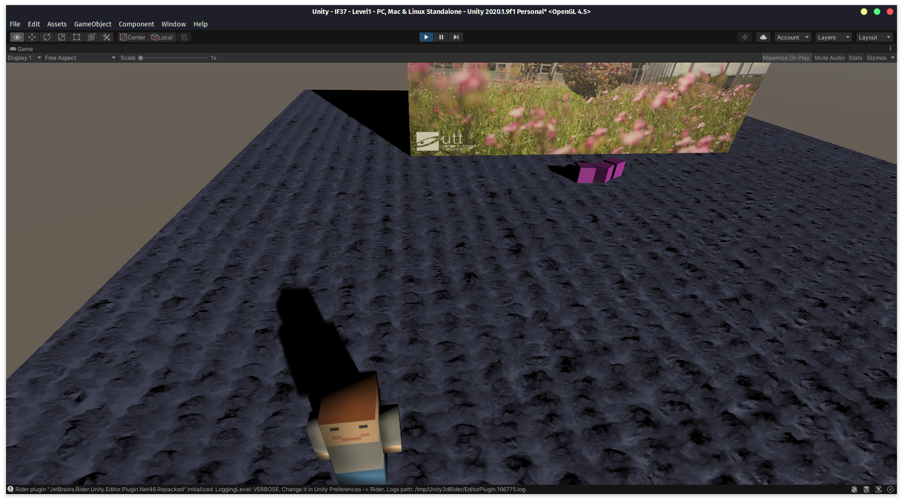
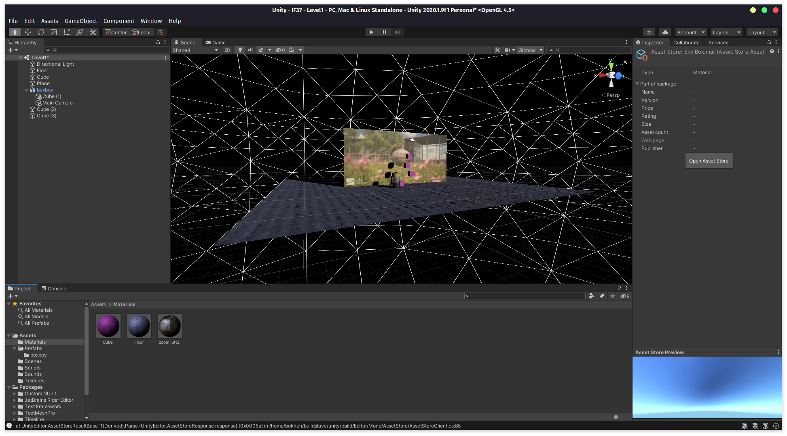
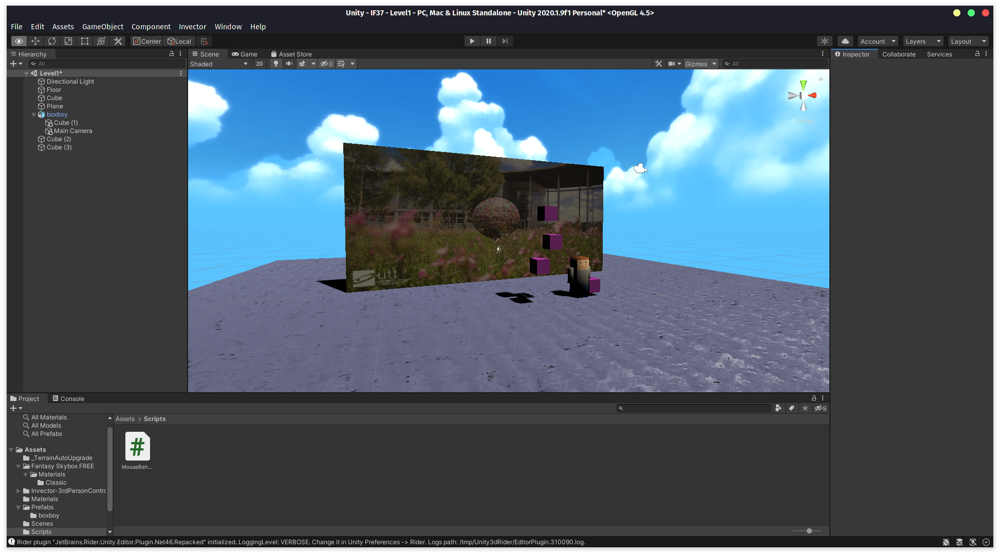
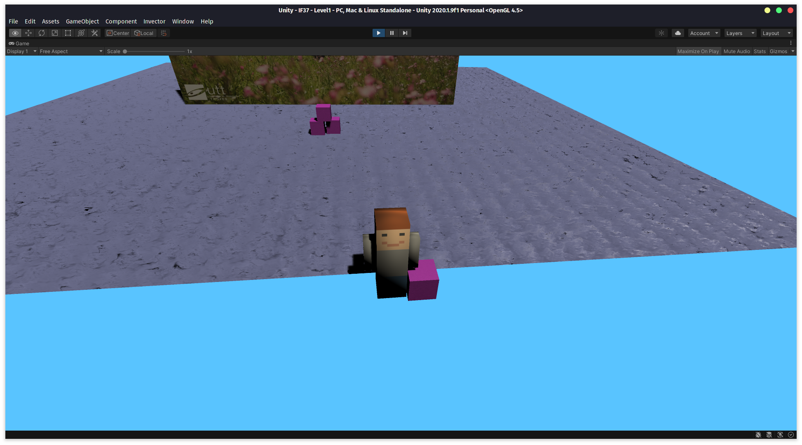
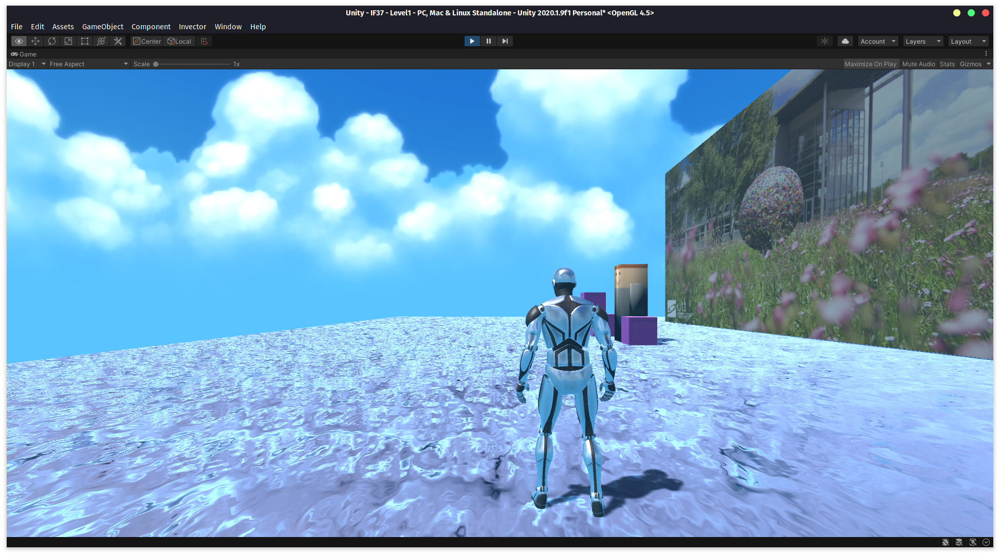
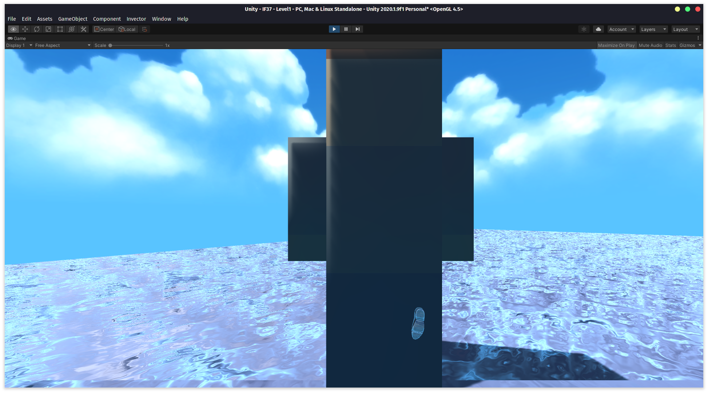

Maxime Huyghe

# TP IF37 Unity - Compte rendu

## Processus

J'ai commencé par ajouter quelques objets à ma scène.

Le matériau du cube utilise une normal map d'une texture de tapis, comme on
peut le voir sur la deuxième capture.

L'apparence du sol est due à une normal map ainsi qu'une height map sur le
matériau.

J'ai ensuite ajouté boxboy à la scène.

Puis d'autres cubes, affectés par la physique (ils étaient originellement
empilés verticalement).

J'ai également fait en sorte que boxboy se déplace lorsqu'on appuie sur les
flèches, et j'ai lié la position de la caméra à la sienne pour créer une sorte
de vue isométrique.

J'ai ensuite essayé quelques skybox, premièrement avec une des textures
intégrées à Unity, étant donné que je n'arrivais pas à faire fonctionner
l'asset store.

Grâce à l'aide de mes camarades, j'ai finalement pu télécharger une skybox.
J'ai également modifié les paramètres d'éclairage.

Ici, boxboy n'est pas affecté par la physique, mais le cube qu'il tient
commence à tomber.

Première intégration du TPC : on peut se déplacer et on respawn après une
chute.

J'ai tenté de rendre boxboy jouable en le plaçant en enfant de l'armature du
TPC. On voit cependant toujours le modèle par défaut du TPC, et il faut un
"avatar" pour remplacer le modèle par défaut, boxboy n'en est malheureusement
pas un.

J'ai aussi fait quelques changements d'eclairage tout au long de mes
modifications.

## Conclusion

J'ai trouvé ce TP très intéressant, et j'ai été surpris par la puissance
d'Unity. Je ne pensais en effet pas qu'on puisse simplifier le prototypage
d'applications 3D à ce point.

